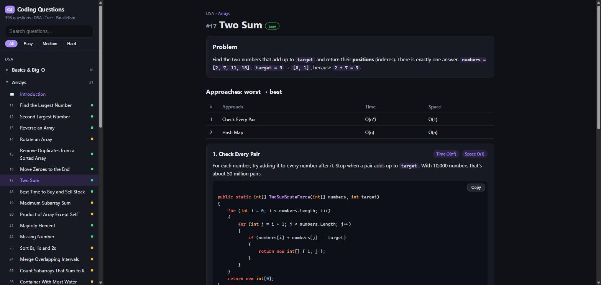
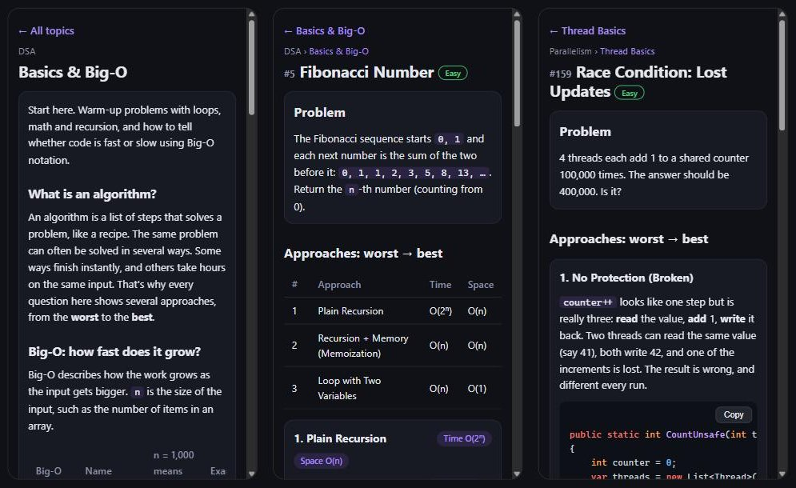

# C# Coding Questions

[](https://github.com/rghvgrv/CSharpCodingQuestions/actions/workflows/deploy.yml)

### 🌐 Live site: **[rghvgrv.live](https://rghvgrv.live)**

Open it on your phone or computer. Nothing to install.

**198 coding questions covering Data Structures & Algorithms, Trees and Parallel Programming, all solved in C#, explained step by step for beginners, in a web app you can use on your phone or desktop.**

Every question shows several solutions **from the worst to the best**, with their time and space complexity, so you learn *why* the fast solution is fast, not just what it is.



<p align="center"></p>

## Features

- **Topic introductions first.** Every topic opens with a plain-language explanation: what it is, a real-life comparison, a table of costs, and a short C# example.
- **Approaches from worst to best.** For example, Fibonacci goes Plain Recursion `O(2ⁿ)` → Memoization `O(n)` → Loop `O(1)` memory. A comparison table sits on top, and every approach explains its idea before its code.
- **Copy button** on every code block. It also works on a phone opening the app over plain `http`.
- **Real results.** The server runs the C# code and shows the actual Input → Output. The parallelism questions run on real threads, so you can watch a race condition lose updates.
- **Beginner-friendly code.** Descriptive names, braces everywhere, no clever one-liners, and self-contained snippets you can paste into your own project.
- **Works on any screen.** On a phone you get the menu or a page; on a desktop, both side by side. Light and dark themes follow your system.
- **Search and filters** by title, number and difficulty (Easy / Medium / Hard).
- **Every answer is verified.** `dotnet run -- --check` runs every approach against every example.

## What's inside

| Section | Topic | Questions | Examples |
|---|---|---:|---|
| **DSA** | [Basics & Big-O](Questions/Dsa/Basics) | 10 | Reverse a String, Fibonacci, Primes up to N, Fast Power |
| | [Arrays](Questions/Dsa/Arrays) | 21 | Two Sum, Kadane's Maximum Subarray, Trapping Rain Water, 3Sum |
| | [Strings](Questions/Dsa/Strings) | 11 | Valid Anagram, Longest Substring Without Repeating, KMP Search |
| | [Hashing](Questions/Dsa/Hashing) | 4 | Contains Duplicate, Longest Consecutive Sequence, Build a Hash Map |
| | [Searching & Sorting](Questions/Dsa/SearchingAndSorting) | 13 | Binary Search, Merge / Quick / Heap Sort, Median of Two Sorted Arrays |
| | [Linked Lists](Questions/Dsa/LinkedLists) | 12 | Reverse a List, Cycle Detection, LRU Cache, Reverse in Groups of K |
| | [Stacks & Queues](Questions/Dsa/StacksAndQueues) | 9 | Valid Parentheses, Min Stack, Sliding Window Maximum |
| | [Recursion & Backtracking](Questions/Dsa/RecursionAndBacktracking) | 8 | Subsets, Permutations, N-Queens, Sudoku Solver |
| | [Bit Manipulation](Questions/Dsa/BitManipulation) | 3 | Count 1 Bits, Power of Two, Single Number |
| | [Heaps & Priority Queues](Questions/Dsa/Heaps) | 5 | Build a Min-Heap, Top K Frequent, Running Median |
| | [Greedy Algorithms](Questions/Dsa/Greedy) | 4 | Jump Game, Gas Station, Fractional Knapsack |
| | [Dynamic Programming](Questions/Dsa/DynamicProgramming) | 11 | Coin Change, 0/1 Knapsack, Edit Distance, Longest Common Subsequence |
| | [Graphs](Questions/Dsa/Graphs) | 13 | BFS, DFS, Dijkstra, Topological Sort, Union-Find, Minimum Spanning Tree |
| **Tree** | [Binary Tree Basics](Questions/Tree/BinaryTreeBasics) | 9 | Pre / In / Postorder (incl. Morris), Level Order, Symmetric Tree |
| | [Binary Tree Problems](Questions/Tree/BinaryTreeProblems) | 13 | Diameter, Lowest Common Ancestor, Serialize, Max Path Sum |
| | [Binary Search Tree](Questions/Tree/BinarySearchTree) | 7 | Search, Insert, Delete, Validate, K-th Smallest |
| | [Advanced Trees](Questions/Tree/AdvancedTrees) | 3 | Trie, Segment & Fenwick Trees, AVL Tree |
| **Parallelism** | [Thread Basics](Questions/Parallelism/ThreadBasics) | 3 | Threads, Thread Pool, Race Conditions |
| | [Synchronization](Questions/Parallelism/Synchronization) | 8 | lock, Interlocked, Deadlock, SemaphoreSlim, ReaderWriterLockSlim, Barrier |
| | [Tasks & async/await](Questions/Parallelism/TasksAndAsync) | 10 | Task.WhenAll, Timeouts, Cancellation, Async Streams, TaskCompletionSource |
| | [Data Parallelism](Questions/Parallelism/DataParallelism) | 7 | Parallel.For, PLINQ, Parallel Merge Sort, Map-Reduce |
| | [Concurrent Collections](Questions/Parallelism/ConcurrentCollections) | 5 | ConcurrentDictionary, BlockingCollection, Channels Pipeline |
| | [Classic Problems](Questions/Parallelism/ClassicProblems) | 9 | Dining Philosophers, Building H₂O, Rate Limiter, Web Crawler |
| | **Total** | **198** | |

Each topic folder has a `README.md`, the same introduction the app shows, so you can also read the course here on GitHub.

## How a question page is organized

1. **Problem**: what to solve, in plain words, with a small example.
2. **Approaches: worst → best**: a Time / Space comparison table, then each approach's idea followed by its code with a Copy button. The last one is marked **Best**.
3. **Result**: the real output of the best approach (Input → Output), or for parallelism demos, what actually happened on the server's threads.

## Tech stack

| Part | Technology |
|---|---|
| Questions and runner | C# 14 on .NET 10 |
| Web API | ASP.NET Core minimal APIs |
| UI | React 19 + Vite, hash routing, no UI framework |
| Code highlighting | highlight.js (C# only) |

## Getting started

**Requirements:** [.NET 10 SDK](https://dotnet.microsoft.com/download) and [Node.js 20+](https://nodejs.org/).

```bash
git clone https://github.com/rghvgrv/CSharpCodingQuestions.git
cd CSharpCodingQuestions
dotnet run
```

The first run installs and builds the React UI into `wwwroot/`, which takes a minute. Then open **http://localhost:5080**.

### Open it on your phone

1. Connect the phone to the **same Wi-Fi** as your computer.
2. Find your computer's local IP address (`ipconfig` on Windows, `ip addr` on Linux, `ifconfig` on macOS).
3. On the phone, open `http://<your-computer-ip>:5080`.
4. If Windows asks about the firewall, allow access on **private** networks.

### Verify every answer

```bash
dotnet run -- --check
```

Every approach of every question runs on every example and must return the expected answer; demos must print their expected values.
The command prints `198/198 passed` and exits with a non-zero code if anything is wrong, crashes or times out.

> **Windows tip:** if Smart App Control / Application Control blocks the newly built `CSharpCodingQuestions.exe`,
> run the DLL instead: `dotnet bin/Debug/net10.0/CSharpCodingQuestions.dll` (add `--check` to verify).

## Deploy to Cloudflare (free, always online)

**Live site:** https://rghvgrv.live (also https://www.rghvgrv.live and https://csharp-coding-questions.gauravaashish1.workers.dev)

Cloudflare serves the app as a static site (Cloudflare Workers static assets, the successor of Cloudflare Pages), so export it first.
Every question runs once, and its result is saved as JSON next to the React app. `wrangler.jsonc` tells Cloudflare to serve the `site` folder.

```bash
dotnet build
dotnet run -- --export          # writes the whole site to ./site (≈ 1 MB)
npx wrangler login              # one time: sign in to Cloudflare in the browser
npx wrangler deploy             # uploads ./site
```

**Automatic deploys.** Every push or merged pull request to `master` runs [`.github/workflows/deploy.yml`](.github/workflows/deploy.yml). It builds the app, runs every question (a wrong answer stops the deploy), exports the site and deploys it to Cloudflare. Pull requests are built and verified but not deployed.
The workflow needs two repository secrets: `CLOUDFLARE_API_TOKEN` (created from the **Edit Cloudflare Workers** token template) and `CLOUDFLARE_ACCOUNT_ID`.

To deploy by hand instead, run `dotnet run -- --export` and `npx wrangler deploy`. Only changed files are uploaded.

**Use your own domain.** The domain must be added to your Cloudflare account (its DNS managed by Cloudflare). Then either:

- open **Workers & Pages → csharp-coding-questions → Settings → Domains & Routes → Add → Custom domain** and enter a subdomain such as `questions.yourdomain.com`, or
- add `"routes": [{ "pattern": "questions.yourdomain.com", "custom_domain": true }]` to `wrangler.jsonc` and run `npx wrangler deploy`.

Cloudflare creates the DNS record and the HTTPS certificate for you.

The hosted site shows the results captured at export time. Parallelism timings are a snapshot of that run, while `dotnet run` shows live results.

## Project structure

```
CSharpCodingQuestions/
├── Program.cs                     Web server (/data/*.json), --check and --export
├── Api/                           JSON responses + static exporter for Cloudflare Pages
├── Core/                          One type per file
│   ├── QuestionAttribute.cs       [Question(Order, Title, Level, Problem)]
│   ├── ApproachAttribute.cs       [Approach(Name, Time, Space, Idea)]
│   ├── Curriculum.cs              Sections and the order of topics
│   ├── QuestionCatalog.cs         Finds questions and topic READMEs, in learning order
│   ├── ApproachSource.cs          Cuts each question file into per-approach code snippets
│   ├── QuestionRunner.cs          Runs examples / demos and checks the answers
│   ├── ConsoleCapture.cs          Captures Console output per run, from any thread
│   ├── Formatter.cs               Turns results into readable text: [1, 2, 3], {a: 1}
│   └── ListNode.cs, TreeNode.cs   Shared data structures used by the questions
├── Questions/
│   └── <Section>/<Topic>/
│       ├── README.md              The topic introduction
│       └── <QuestionName>.cs      One question: approaches (worst → best), then Examples or Demo
├── web/                           React UI (Vite) → builds into wwwroot/
│   └── src/components/            Sidebar, HomePage, TopicPage, QuestionPage, CodeBlock, Markdown
└── docs/                          Screenshots for this README
```

## Add your own question

Create `Questions/<Section>/<Topic>/<ClassName>.cs`. The file name must match the class name. Write the approaches **from worst to best**:
everything from one `[Approach]` to the next is shown as that approach's code.

```csharp
namespace CSharpCodingQuestions.Questions.Dsa.Arrays;

[Question(Order = 22, Title = "Sum of an Array", Level = Easy, Problem = """
    Return the sum of all numbers in the array.
    """)]
public static class SumOfArray
{
    [Approach(Name = "Loop", Time = "O(n)", Space = "O(1)", Idea = """
        Add the numbers one by one.
        """)]
    public static int SumWithLoop(int[] numbers)
    {
        int total = 0;
        foreach (int number in numbers)
        {
            total += number;
        }
        return total;
    }

    public static Example[] Examples =>
    [
        new([new[] { 1, 2, 3 }], 6),
    ];
}
```

- **Examples**: each has the input arguments and the expected answer. Every approach must return it.
- **Demo instead of Examples**: for questions without fixed inputs (like the parallelism ones), write `public static void Demo()` and use `Print(label, value, expected)`.
- **Shared code**: helpers written above the first `[Approach]` are shown in a "Shared code" block.
- **New topic**: add a folder with a `README.md` (first line `# Title`, then a one-paragraph summary) and list it in `Core/Curriculum.cs`.

Then run `dotnet run -- --check`.

## UI development

```bash
dotnet run                    # API on http://localhost:5080
cd web && npm run dev         # hot-reload UI on http://localhost:5173 (proxies /api to :5080)
cd web && npm run build       # rebuild wwwroot/ after UI changes
```
